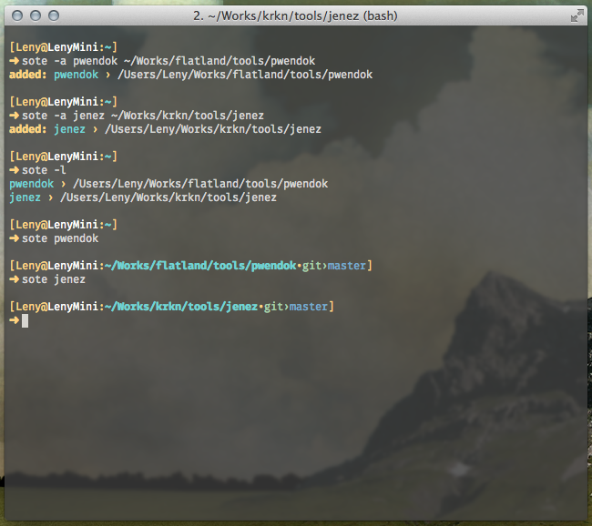

# sote

> Shell favorites paths, for faster `cd`.

* * *

**sote** is like a perpetual `pushd` : he stores your favorites system paths, so you can jump to it by typing `sote <name>`.

## Installation
**sote** embeds his own installation procedure. You can use one of the commands below to install it on your system :

### Install with `curl`


```bash
curl -sS https://raw.githubusercontent.com/krkn/sote/master/bin/sote | bash
```

### Install with `wget`

```bash
wget -q -O - https://raw.githubusercontent.com/krkn/sote/master/bin/sote | bash
```

### Manually from GIT repo

```bash
git clone https://github.com/krkn/sote ~/.sote && ~/.sote/bin/sote
```

> This one install all the GIT repo (the previous one have juste the Sote script).

## Usage

```bash
sote [options] <name>

    Name:

        *                      Jumps to the path corresponding to the given name.

    Options:

        -h, --help                   Output usage information
        -v, --version                Output the version number
        -l, --list                   Lists the paths stored by sote.
        -s, --show <name>            Shows the path corresponding to the given name.
        -a, --add <name> [path]      Add the path to the store with the given name. If no path is given, use current path.
        -r, --remove <name>          Remove the path stored by sote at the given name.
        -c, --clear                  Clear all the paths stored by sote. Ask for confirmation before acting.
```

### Example

An explicit image is better than thousands words, so :



## Contributing

In lieu of a formal styleguide, take care to maintain the existing coding style.

## Release History

* **0.1.3**: Bugfix embeds install procedure, transert ownership to [krkn](https://github.com/krkn) (*09/09/14*)
* **0.1.2**: Add an embeds install procedure (*31/07/14*)
* **0.1.1**: Bugfixes (*31/07/14*)
* **0.1.0**: Rewrite in bash, first release (*17/07/14*)
* **0.0.1**: Starting project (*19/06/14*)

### TODO

* [ ] Check/Fix compatibility with
    * [ ] Linux
    * [ ] Windows

## License

Copyright (c) 2014 krkn  
Licensed under the MIT license.
